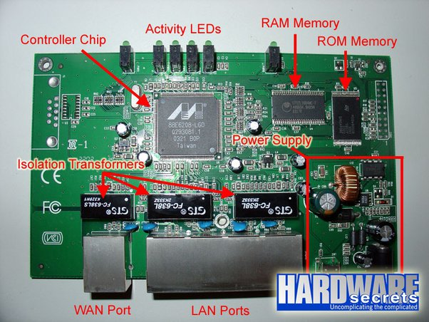

# car_voice_controller

Control a car using your voice via Arduino

Voice app link : <a href="https://amr-voice.en.aptoide.com/">Download App</a>

Here's the Parts List:

1. Arduino Uno
2. Motor Driver Shield
3. Wheels (4x)
4. TT Gear Motor (4x)
5. Servo Motor
6. Ultrasonic Sensor
7. 18650 Li-on Battery
8. 18650 Battery Holder
9. Male and Female Jumper wire
10. Acrylic Sheet
11. DC Power Switch
12. HC-05 Bluetooth Module

Circuit Daigram

WIFI ROUTER COMPONENTS

a. ROM:- For operating system software.

b. Flash memory: - holds the operating systems images. The content is retained when the router is
restarted.

c. RAM: - Used to store the Routing tables, configuration files, caching and buffering details.
Content is lost when lost router is switched off or restarted.

d. NVRAM:- Stores the routers startup config files. Data is non volatile.

e. Network interfaces to connect router to network
