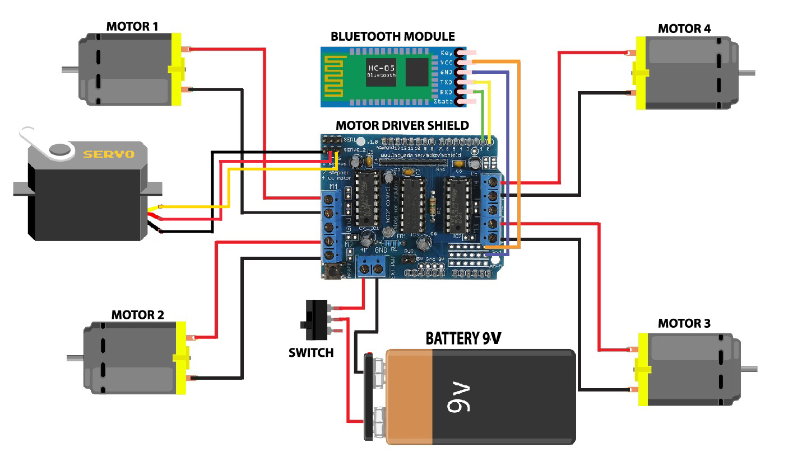

# car_voice_controller

Control a car using your voice via Arduino

Voice app link : <a href="https://amr-voice.en.aptoide.com/">Download App</a>

Here's the Parts List:
1) Arduino Uno 
2) Motor Driver Shield 
3) Wheels (4x) 
4) TT Gear Motor (4x) 
5) Servo Motor 
6) Ultrasonic Sensor 
6) 18650 Li-on Battery 
7) 18650 Battery Holder 
8) Male and Female Jumper wire 
9) Acrylic Sheet 
10) DC Power Switch 
11)  HC-05 Bluetooth Module 

Circuit Daigram

